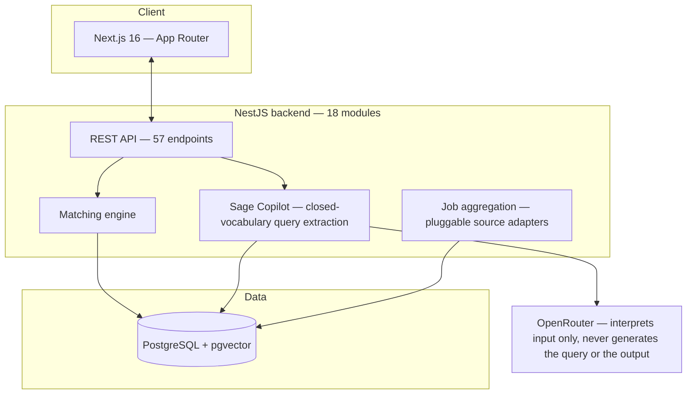

# InternSage

**The evidence layer between education and employment.**

A CV tells you what someone claims. InternSage shows what the evidence actually supports — and turns that into better decisions for students, recruiters, and university career centres, on one connected platform instead of three disconnected ones.


**© 2026 Nahid Hasan Rayan.** The InternSage concept, architecture, and terminology — including "Sage Copilot" and "Career & Workforce Decision Room" 

---

## Why this exists

In Q4 2025, 35.3% of tertiary-educated employed Malaysians were in skill-related underemployment — not unemployed, just in roles that don't use what they actually studied. Meanwhile, 56% of Malaysian employers report a shortage of candidates with the skills they need. That gap isn't really about job discovery. It's about three separate people — a student, a recruiter, and a university career centre — all working from incomplete, unverified information, with no shared evidence layer connecting what any of them actually knows.

InternSage is that layer.

## The loop


A claimed skill becomes trustworthy through institutional identity, a timed skill assessment, and portfolio evidence. That evidence drives an explainable match score — deterministic, not a black box. Recruiters query the verified pool in plain language through Sage Copilot. Students and universities both get a Decision Room: career-path comparison at the individual level, cohort diagnostics at the institutional level. Every outcome — an application, an offer, a placement — feeds back into the loop instead of disappearing after one transaction.

## Three sides, one evidence layer

| | Friction today | What InternSage does |
|---|---|---|
| **Student** | Unverified skills, opaque rejections, no visibility into gaps | Evidence-backed profile, explainable matches, a real Decision Room for career planning |
| **Recruiter / SME** | High application volume, no dedicated screening team | Verification-weighted ranking, plus Sage Copilot to query the pool in plain language |
| **University** | Capability, employer demand, and outcomes tracked in three disconnected places | One dashboard linking cohort skill data, real placement signal, and employer partnerships |

## What's actually built

This isn't a mockup. 18 backend modules, 57 API endpoints, 149 automated tests — all real, all currently passing, all deployed.

<details>
<summary><strong>Full status by area</strong> (click to expand)</summary>

| Area | Status |
|---|---|
| Identity, auth, domain-verified accounts | ✅ Live |
| CV, skills, portfolio evidence | ✅ Live |
| Job aggregation (real Malaysian postings + legitimate public APIs) | ✅ Live |
| Matching engine | ✅ Live — deterministic skill-intersection is real; the semantic-similarity component is an honestly-documented placeholder today, with `pgvector` already provisioned for the real embedding upgrade |
| Verification (timed skill assessment) | ✅ Live |
| Applications & recruiter workflow | ✅ Live |
| Sage Copilot (recruiter search assistant) | ✅ Live — closed-vocabulary query extraction, never freeform LLM-generated queries, with protected characteristics excluded at the query layer itself, not just by prompt instruction |
| Decision Room (student + market trends) | ✅ Live |
| University portal (dashboard, analytics, partners, events) | ✅ Live |
| Messaging | ✅ Live |
| Featured students | 🚧 Scoped, not yet built |
| Industry Pulse, AI Tutor, Guidance/Roadmap, verified exports | 🚧 Frontend built, backend pending |

</details>

## Architecture



A deliberate split runs through the whole backend: **decisions are computed deterministically, a language model is only ever used to interpret an ambiguous input into a constrained, whitelisted structure — never to generate a query freely, and never to narrate or fabricate an output.** Sage Copilot's LLM call extracts search filters (skill, university, year) from a recruiter's plain-language question; the actual database query is then built entirely from that fixed, whitelisted shape, never from freeform text the model produced. Match scores and Decision Room insights are separate, non-LLM code paths entirely — real arithmetic and deterministic templates, not generated language. If the LLM is unavailable, Sage Copilot falls back to a rule-based parser covering the same fixed set of filters — degraded, not broken.

## Repo structure

```
internsage/
  web/     — Next.js frontend (App Router, React 19, Tailwind v4)
  server/  — NestJS backend (Prisma + PostgreSQL, deployed as Vercel serverless functions)
  infra/   — docker-compose.yml for local Postgres + pgvector
```

Each of `web/` and `server/` has its own README with local-dev setup. **[`DEPLOYMENT.md`](./DEPLOYMENT.md) is the full guide** for standing up your own instance on Vercel + Supabase.

## Running it locally

```bash
git clone https://github.com/Nahid-Hasan-Rayan/InternSage.git
cd InternSage

# Backend
cd server && cp .env.example .env   # fill in DATABASE_URL, JWT_SECRET, CORS_ORIGINS
npm install && npx prisma db seed && npm run start:dev

# Frontend, in a second terminal
cd web && cp .env.local.example .env.local
npm install && npm run dev
```


## License

Copyright (c) 2026 Nahid Hasan Rayan. All rights reserved. See [`LICENSE`](./LICENSE).
